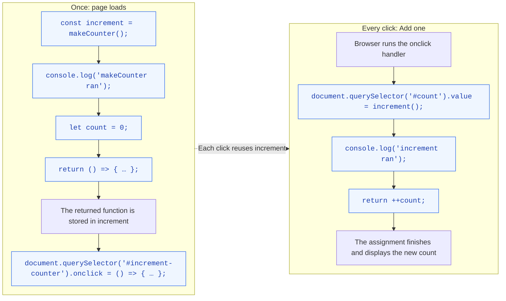

# JavaScript Closure: Counter Flow

Blue text shows JavaScript from the counter example. The click handler reuses the function created during setup.

```mermaid
---
config:
  flowchart:
    rankSpacing: 16
    nodeSpacing: 20
    diagramPadding: 6
---
flowchart LR
    subgraph Setup["Once: page loads"]
        direction TB
        A["const increment = makeCounter();"] --> B["console.log('makeCounter ran');"]
        B --> C["let count = 0;"]
        C --> D["return () =&gt; { … };"]
        D --> Stored["The returned function is stored in increment"]
        Stored --> Registered["document.querySelector('#increment-counter').onclick = () =&gt; { … };"]
    end

    subgraph Click["Every click: Add one"]
        direction TB
        E["Browser runs the onclick handler"] --> F["document.querySelector('#count').value = increment();"]
        F --> Log["console.log('increment ran');"]
        Log --> G["return ++count;"]
        G --> H["The assignment finishes and displays the new count"]
    end

    Setup -. "Each click reuses increment" .-> Click

    classDef javascript fill:#eff6ff,stroke:#2563eb,color:#1e40af,font-family:monospace;
    class A,B,C,D,Registered,F,Log,G javascript;
```
