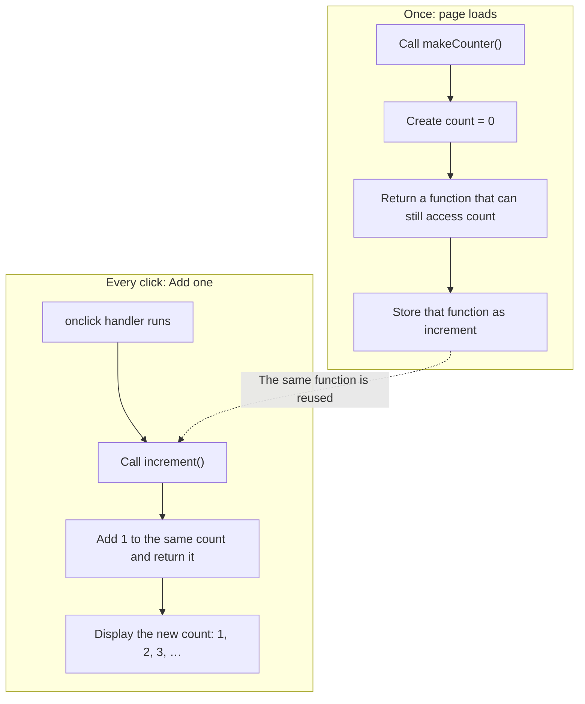

# JavaScript Closure: Counter Flow

```mermaid
flowchart TD
    subgraph Setup["Once: page loads"]
        A["Call makeCounter()"] --> B["Create count = 0"]
        B --> C["Return a function that can still access count"]
        C --> D["Store that function as increment"]
    end

    subgraph Click["Every click: Add one"]
        E["onclick handler runs"] --> F["Call increment()"]
        F --> G["Add 1 to the same count and return it"]
        G --> H["Display the new count: 1, 2, 3, …"]
    end

    D -. "The same function is reused" .-> F
```
